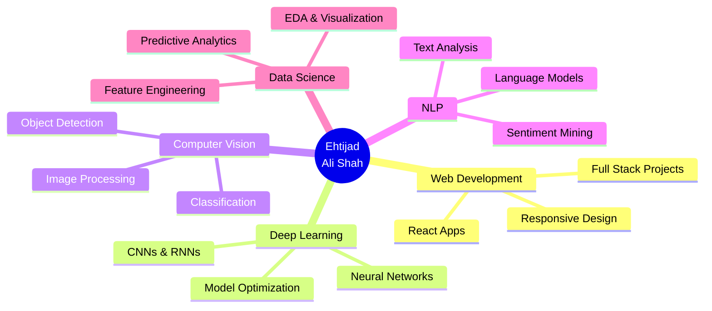

# 👋 Hi, I'm Ehtijad Ali

### 🚀 Junior Data Scientist | Full-Stack Developer | AI Enthusiast

 

---

## 🎯 About Me

Hey there! 👋 I'm **Ehtijad Ali**, a passionate **Junior Data Scientist** and **FrontEnd Web Developer** based in the beautiful valleys of Yasin, Pakistan. 

I bridge the gap between **data-driven insights** and **interactive web experiences**. My journey in tech encompasses everything from building intelligent AI models to crafting responsive, user-friendly websites that bring ideas to life.

**What drives me:**
- 🔍 Extracting meaningful patterns from complex datasets
- 💻 Creating elegant web solutions with modern technologies
- 🤖 Building AI-powered applications that solve real-world problems
- 🎨 Designing visually stunning experiences
- 🌍 Exploring new places and cultures (Goal: Visit every continent!)

**⚡ Fun Fact:** When I'm not coding or analyzing data, you'll find me planning my next adventure or creating designs that tell stories!

---

## 💼 What I Do

| 🔬 **Data Science** | 🤖 **AI/ML** | 💻 **Web Development** | 🎨 **Creative** | 📈 **SEO** |
|:---:|:---:|:---:|:---:|:---:|
| Statistical Analysis | Model Development | Frontend Design | Canva Design | Search Optimization |
| Data Visualization | Neural Networks | Backend APIs | Brand Identity | Content Strategy |
| Predictive Modeling | Deep Learning | Full-Stack Apps | UI/UX Design | Analytics |

---

## 🛠️ Tech Stack

### 💻 Programming Languages

<table>
<tr>
<td align="center" width="96">

 Python
</td>
<td align="center" width="96">

 R
</td>
<td align="center" width="96">

 JavaScript
</td>
<td align="center" width="96">

 React
</td>
</tr>
</table>

### 🌐 Web Development

**🚀 Web Services I Offer:**
- ✨ Responsive Website Design & Development
- ⚛️ Modern React Applications
- 🎨 Interactive UI/UX Design
- 📱 Mobile-First Development
- 🔧 Website Maintenance & Optimization
- 🛒 E-commerce Solutions

### 🔧 Tools & Platforms

<table>
<tr>
<td align="center" width="96">

 Jupyter
</td>
<td align="center" width="96">

 VS Code
</td>
<td align="center" width="96">

 Colab
</td>
<td align="center" width="96">

 Anaconda
</td>
</tr>
<tr>
<td align="center" width="96">

 Git
</td>
<td align="center" width="96">

 GitHub
</td>
<td align="center" width="96">

 Canva
</td>
<td align="center" width="96">

 Power BI
</td>
</tr>
<tr>
<td align="center" width="96">

 Excel
</td>
<td align="center" width="96">

 Tableau
</td>
</tr>
</table>

### 📚 Libraries & Frameworks

<table>
<tr>
<td align="center" width="96">

 NumPy
</td>
<td align="center" width="96">

 Pandas
</td>
<td align="center" width="96">

 Matplotlib
</td>
<td align="center" width="96">

 SciPy
</td>
<td align="center" width="96">

 Seaborn
</td>
</tr>
<tr>
<td align="center" width="96">

 Keras
</td>
<td align="center" width="96">

 PyTorch
</td>
<td align="center" width="96">

 TensorFlow
</td>
<td align="center" width="96">

 Scikit-learn
</td>
</tr>
</table>

## 🎯 Current Focus

---

## 🌟 Skills Proficiency

| Skill Category | Proficiency |
|:---|:---|
| 🐍 Python Programming | ██████████ 95% |
| ⚛️ React Development | █████████░ 90% |
| 🌐 HTML/CSS/JavaScript | █████████░ 92% |
| 📊 Data Analysis | █████████░ 90% |
| 🤖 Machine Learning | ████████░░ 85% |
| 🧠 Deep Learning | ███████░░░ 80% |
| 👁️ Computer Vision | ███████░░░ 75% |
| 💬 Natural Language Processing | ██████░░░░ 70% |
| 🎨 Data Visualization | █████████░ 88% |
| 🎯 SEO & Digital Marketing | ████████░░ 82% |
| 🖌️ UI/UX Design | ████████░░ 78% |

---

## 💼 Services I Offer

<table>
<tr>
<td align="center" width="33%">

<h3>🌐 Web Development</h3>

Custom websites, React apps, responsive design, and modern web solutions

</td>
<td align="center" width="33%">

<h3>📊 Data Science</h3>

Data analysis, visualization, predictive modeling, and business insights

</td>
<td align="center" width="33%">

<h3>🤖 AI/ML Solutions</h3>

Machine learning models, computer vision, NLP, and AI integration

</td>
</tr>
<tr>
<td align="center" width="33%">

<h3>🎨 Design Services</h3>

UI/UX design, brand identity, Canva creations, and visual content

</td>
<td align="center" width="33%">

<h3>📈 SEO & Marketing</h3>

Search optimization, content strategy, analytics, and digital growth

</td>
<td align="center" width="33%">

<h3>🔧 Consulting</h3>

Tech consulting, project guidance, code reviews, and mentorship

</td>
</tr>
</table>

---

## 🤝 Connect With Me

---

## 💡 Random Dev Quote

---

## 🐍 Watch Me Code

---

### 💭 "Transforming Data into Decisions, Code into Experiences"

**⭐ From [Ehtijad Ali Shah](https://github.com/ehtijadalishah) | Open for Collaboration & Freelance Projects!**

